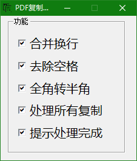
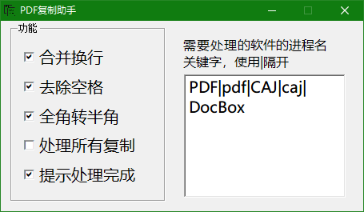
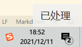

# PDF复制助手V1.0

本项目主要是因为复制文献时候如pdf，caj等会出现大量空格、全角、分段等问题，需要软件自动处理，但是已有软件虽然功能可以用，但是存在以下问题
1. 时不时失灵，而且还不知道究竟处理成功没，经常出现复制了但是没处理，然后需要重新开软件才能用
2. 处理一股脑处理，有些不需要处理的也会处理

本项目fork了以下项目：

https://github.com/svhero658/PDFCopyPaste

https://github.com/CopyPlusPlus/CopyPlusPlus

第二个主要是因为界面不爽，有推广，然后无聊了，想自己用

本软件主要来源是第一个，使用了部分第二个的代码，进行了bug修复和改进，改进如下

1. 参数可以保存
2. 添加了主窗口和最小化功能
3. 能够处理半角和中文空格（代码来源于第二个）
4. 能够自定义处理软件
5. 添加了处理成功提示（右下角）

### 不含任何推广和其他东西

# 预览图
  

  

  

